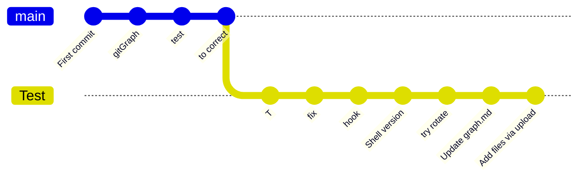

```mermaid
	gitGraph
	commit id:"First commit"
	commit id:"gitGraph"
	commit id:"test"
	commit id:"to correct"
	branch Test
	commit id:"T"
	commit id:"fix"
	commit id:"hook"
	commit id:"Shell version"
	commit id:"try rotate"
	commit id:"Update graph.md"
	commit id:"Add files via upload"
```
